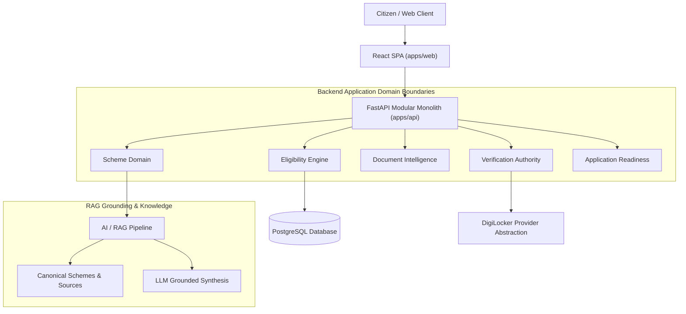
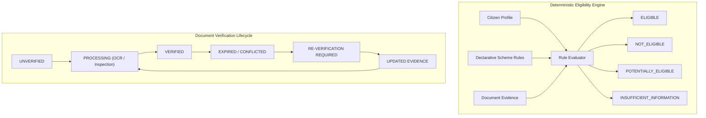

# CBIP

### Citizen Benefits Intelligence Platform

*A citizen-centric intelligence platform for personalized government scheme discovery, explainable eligibility, document verification, and application readiness.*

`Discover → Understand → Verify → Stay Ready`


**Team ARHA** | **Smart India Hackathon 2026** | **Problem Statement PSS1 — Government Scheme Awareness and Eligibility Assistant**

---

## 1. Why CBIP?

Millions of Indian citizens remain unaware of welfare schemes for which they are eligible. Even when citizens learn about a scheme, they struggle to answer critical questions:
- *Do I qualify under the latest government rules?*
- *Why exactly am I eligible or ineligible?*
- *Which official documents serve as valid evidence?*
- *Is my current document evidence expired or outdated?*
- *What concrete steps must I take to submit an application?*

**CBIP (Citizen Benefits Intelligence Platform)** solves this by providing a unified, intelligent pipeline that transforms unstructured scheme guidelines into deterministic, auditable eligibility evaluations, grounded multi-lingual explanations, and a continuous document verification lifecycle.

---

## 2. Why Not Just myScheme?

Official scheme discovery portals such as **myScheme** perform a vital service by cataloging government welfare programs. CBIP complements the scheme-discovery ecosystem by focusing on the deeper citizen journey beyond surface-level discovery:

$$\text{Discovery} \longrightarrow \text{Personalization} \longrightarrow \text{Explainable Eligibility} \longrightarrow \text{Evidence Prep} \longrightarrow \text{Verification} \longrightarrow \text{Re-Verification} \longrightarrow \text{Application Readiness}$$

CBIP is **not** intended to replace official government portals or handle application submissions. Instead, it prepares citizens to become fully application-ready with verified document evidence and source-grounded guidance before visiting official portals.

---

## 3. What Makes CBIP Different

| Feature | Description |
| :--- | :--- |
| **Personalized Discovery** | Matches scheme opportunities against verified citizen demographic and socio-economic profiles. |
| **Explainable Eligibility** | Generates transparent, rule-by-rule audit breakdowns detailing met criteria and unmet requirements. |
| **Grounded RAG** | Uses retrieval-augmented generation grounded strictly in official gazette notifications and portal source citations. |
| **Document Intelligence** | Extracts structured fields from uploaded document evidence via OCR and layout analysis. |
| **Evidence Verification** | Manages explicit evidence lifecycles, validity constraints, and acceptable issuing authorities. |
| **Continuous Re-Verification** | Triggers automated re-verification alerts when document evidence or citizen profile data becomes outdated. |
| **DigiLocker Provider Abstraction** | Decouples document verification through an extensible provider abstraction (`DigiLockerProvider`). |
| **Application Readiness** | Provides step-by-step application procedures, official URLs, and missing document checklists. |

---

## 4. Core Architectural Principle

> [!IMPORTANT]
> $$\text{LLM} \neq \text{Eligibility Engine} \neq \text{Verification Authority}$$

1. **LLM**: Responsible strictly for natural language understanding (NLU), multi-lingual translation, user query formulation, grounded conversational synthesis, and OCR text extraction assistance. The LLM **NEVER** makes authoritative eligibility decisions.
2. **Eligibility Engine**: A deterministic, auditable, and versioned rule evaluator that evaluates structured scheme criteria against verified citizen attributes.
3. **Verification Authority**: Controls document upload validation, OCR structure extraction, document expiration lifecycles, and re-verification triggers.

---

## 5. System Architecture

CBIP is built as a **Modular Monolith** to maintain domain boundaries while avoiding premature microservice fragmentation during rapid iteration.



---

## 6. AI / RAG Knowledge Pipeline

The RAG pipeline provides grounded, conversational explanations backed by official government citations.


---

## 7. Eligibility Engine & Verification Lifecycle

Eligibility evaluation is deterministic and resolves to exactly one of **4 Explicit States**:



---

## 8. Technology Stack

| Layer | Technologies |
| :--- | :--- |
| **Backend** | Python 3.12+, FastAPI, Pydantic v2, SQLAlchemy 2.0 (Async), Alembic, PostgreSQL, asyncpg |
| **Frontend** | React 19, TypeScript, Vite, Tailwind CSS *(Planned)* |
| **AI / RAG** | Vector Embeddings, Grounded RAG, Retrieval Reranking, Ragas Evaluation Framework *(Planned)* |
| **Infrastructure** | Docker, Docker Compose, GitHub Actions CI/CD |

---

## 9. Repository Structure

```
sih-arha/
├── apps/
│   ├── api/             # FastAPI Modular Monolith Backend
│   └── web/             # React + TypeScript + Vite Frontend (Planned)
├── ai/                  # AI, RAG pipelines & prompt engineering (Planned)
│   ├── rag/
│   ├── prompts/
│   └── evaluation/
├── packages/
│   └── shared/
│       └── scheme/      # Canonical Scheme Pydantic models, parser & validator
├── data/
│   └── schemes/         # Scheme YAML specs & canonical schema
│       ├── schema.yaml
│       └── examples/
├── docs/
│   ├── architecture/    # Architecture documentation & diagrams
│   ├── decisions/       # Architecture Decision Records (ADR-001, ADR-002)
│   ├── research/        # Scheme research notes & policy analyses
│   └── api/             # API contracts & OpenAPI specs
├── infra/               # Containerization & CI/CD workflows
│   ├── docker/
│   └── ci/
└── tests/               # Integration & end-to-end test suites
```

---

## 10. Current Engineering Status

| Domain / Milestone | Status | Details |
| :--- | :--- | :--- |
| **Repository Foundation** | `DONE` | Monorepo structure, git conventions, `CONTRIBUTING.md` |
| **Architecture ADRs** | `DONE` | [ADR-001](docs/decisions/ADR-001-project-architecture.md) (Modular Monolith) & [ADR-002](docs/decisions/ADR-002-scheme-specification.md) (Scheme Schema) |
| **Scheme Spec Contract** | `DONE` | [schema.yaml](data/schemes/schema.yaml) template & [example-scheme.yaml](data/schemes/examples/example-scheme.yaml) |
| **Pydantic Scheme Validator** | `DONE` | Full structural validation & AST parser (`packages/shared/scheme/`) |
| **Semantic Validator** | `DONE` | Cross-reference checks for dangling sources, duplicate rule IDs, document bounds |
| **Scheme CI Validation** | `DONE` | GitHub Actions workflow (`.github/workflows/validate-schemes.yml`) |
| **FastAPI App Foundation** | `DONE` | FastAPI startup, settings, logging, async DB session setup, `GET /health` |
| **PostgreSQL Domain Models** | `PLANNED` | ORM entities for citizen profiles, schemes, and verification state |
| **Eligibility Engine** | `PLANNED` | Deterministic AST evaluator implementation |
| **RAG Pipeline** | `PLANNED` | Vector retrieval, grounding, and citation generation |
| **Document Intelligence** | `PLANNED` | OCR parsing & structured extraction |
| **Verification Authority** | `PLANNED` | Document lifecycle state manager & expiration alerts |
| **DigiLocker Integration** | `PLANNED` | Provider abstraction (`DigiLockerProvider`) with simulated mock |
| **Web Frontend** | `PLANNED` | React + Vite citizen-facing portal |

---

## 11. Development Setup

### Prerequisites
- **Python**: `3.10+` (Python 3.12 recommended)
- **Node.js**: `v20+` (for frontend tasks)
- **Git**

### Local Setup Instructions

1. **Clone the Repository**:
   ```bash
   git clone git@github-arha:Cholan-kinnera/sih-arha.git
   cd sih-arha
   ```

2. **Validate Scheme Specifications**:
   ```bash
   python3 -m packages.shared.scheme.cli validate data/schemes/examples/example-scheme.yaml
   ```

3. **Backend Development**:
   ```bash
   # Navigate to backend app directory
   cd apps/api

   # Create & activate virtual environment
   python3 -m venv .venv
   source .venv/bin/activate

   # Install dependencies
   pip install -e .

   # Run backend tests
   PYTHONPATH=../.. pytest tests/ -v

   # Start FastAPI dev server
   PYTHONPATH=../.. uvicorn src.main:app --reload --port 8000
   ```

4. **Verify Health Endpoint**:
   ```bash
   curl http://127.0.0.1:8000/health
   # Response: {"status": "ok"}
   ```

---

## 12. Engineering Principles

1. **Modular Monolith First**: Maintain strict domain boundaries; defer microservices until production scale demands it.
2. **Deterministic Eligibility**: Business logic and scheme eligibility are 100% auditable and code-tested; LLMs never determine eligibility.
3. **Source-Grounded AI**: Every AI explanation must map to official government source citations.
4. **Evidence-First Design**: Define document evidence requirements explicitly without embedding user state into scheme models.
5. **No Secrets in Source Control**: Credentials and keys are configured strictly via environment variables.
6. **Architecture Driven by ADRs**: Document significant architectural choices in `docs/decisions/`.

---

## 13. Team ARHA

* **Technical Lead**: Overall Architecture, Backend APIs, AI/RAG Integration, Core Systems
* **Developer 2**: Frontend & UI/UX Design System
* **Developer 3**: AI/RAG Specialist & Scheme Knowledge Base
* **Developer 4**: Document Intelligence, Verification Authority & DevOps
* **Member 5**: Scheme Research & Technical Documentation (LaTeX)
* **Member 6**: Product Demo, Presentation & Pitch Preparation

---

## 14. Roadmap

- [x] Repository & Monorepo Foundation
- [x] Architecture Decision Records ([ADR-001](docs/decisions/ADR-001-project-architecture.md), [ADR-002](docs/decisions/ADR-002-scheme-specification.md))
- [x] Canonical Scheme Specification Contract ([schema.yaml](data/schemes/schema.yaml))
- [x] Pydantic Scheme Parser & Semantic Validator (`packages/shared/scheme/`)
- [x] Automated Scheme CI Validation (`.github/workflows/validate-schemes.yml`)
- [x] FastAPI Application & Health Foundation (`apps/api/`)
- [ ] Database Domain Models & Alembic Migrations
- [ ] Deterministic Eligibility Rule Evaluator
- [ ] RAG Pipeline & Vector Indexing
- [ ] Document Intelligence OCR & Extraction Pipeline
- [ ] Verification Authority Lifecycle & Expiration Alerts
- [ ] DigiLocker Provider Abstraction Layer
- [ ] React Frontend Web Portal
- [ ] End-to-End Application Readiness & Demo Flow

---

## 15. Documentation Links

- **[CONTRIBUTING.md](CONTRIBUTING.md)**: Engineering guidelines, branching strategy, commit conventions.
- **[ADR-001: Project Architecture](docs/decisions/ADR-001-project-architecture.md)**: Architecture Decision Record for Monorepo Modular Monolith.
- **[ADR-002: Scheme Specification Schema](docs/decisions/ADR-002-scheme-specification.md)**: Architecture Decision Record for Scheme Specification Data Contract.
- **[Scheme Specification Architecture](docs/architecture/scheme-specification.md)**: Comprehensive technical documentation of the scheme specification format and AST parser.
- **[Canonical Scheme Schema Template](data/schemes/schema.yaml)**: Commented template schema file.
- **[Example Synthetic Scheme](data/schemes/examples/example-scheme.yaml)**: Model synthetic scheme definition (`SCHEME-SYNTH-001`).

---

## 16. Project Status & License

**Status**: Active development — **Smart India Hackathon 2026** (Problem Statement **PSS1**).

Developed by **Team ARHA**.
