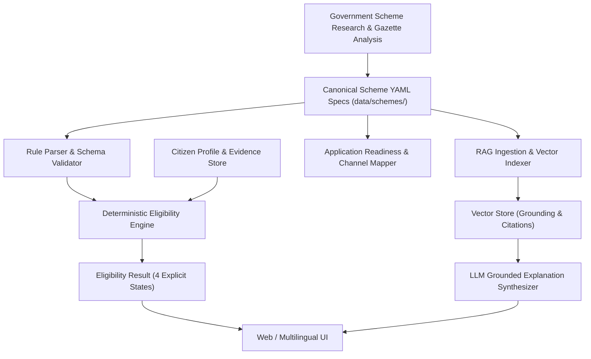

# Scheme Specification Schema Architecture

## 1. Overview & Purpose

The **Canonical Scheme Specification Schema** serves as the central data contract for the **Citizen Benefits Intelligence Platform (CBIP)**. It bridges government scheme research, deterministic eligibility evaluation, RAG knowledge indexing, document verification requirements, application readiness workflows, and frontend user presentation.



---

## 2. Core Architectural Principles

1. **Declarative Rules (Data over Code)**:
   - Eligibility logic is specified as structured, declarative data trees (`YAML/JSON`).
   - No Python `if/else` statements, lambda functions, or custom DSL code are embedded in scheme files.

2. **Strict Separation of Verification State**:
   - The schema specifies *what* evidence is required (e.g., `INCOME_CERTIFICATE`).
   - It does **NOT** store citizen verification state (e.g., whether a citizen's certificate is valid or expired). Verification lifecycle remains the sole responsibility of the Verification Authority.

3. **First-Class Source Provenance**:
   - Every scheme metadata block, eligibility condition, and document requirement links back to an authoritative government source (`source_id` + citation details).

4. **Auditability & Traceability**:
   - Versioning (`scheme_version`, `effective_from`, `effective_until`) ensures historical eligibility assessments can be audited against the exact scheme definition active at the time of evaluation.

---

## 3. Top-Level Schema Structure

```yaml
scheme:
  id: "SCHEME-SYNTH-001"
  code: "SYNTH-SCHOLARSHIP-2026"
  name: "Synthetic Higher Education Assistance Scheme"
  short_name: "SHEAS"
  slug: "synthetic-higher-education-assistance"
  version: "1.0.0"
  status: "ACTIVE"
  effective_from: "2026-01-01"
  effective_until: null

metadata:
  ministry: "Ministry of Education"
  department: "Department of Higher Education"
  category: "SCHOLARSHIP"
  description: "Financial assistance for eligible students pursuing higher education."
  objective: "To support meritorious students from economically weaker backgrounds."
  target_beneficiaries:
    - "Higher education students"
    - "Low-income households"
  tags:
    - "education"
    - "scholarship"
    - "financial-aid"

geographic_scope:
  level: "STATE"
  states:
    - "Karnataka"
  districts: []

sources:
  - id: "SRC-001"
    type: "GAZETTE_NOTIFICATION"
    title: "Official Notification No. EDU/2026/001"
    publisher: "Government of Karnataka"
    url: "https://example.gov.in/notifications/edu-2026-001.pdf"
    publication_date: "2025-12-15"
    effective_date: "2026-01-01"
    retrieved_at: "2026-08-21T00:00:00Z"
    version: "1.0"

eligibility:
  operator: "AND"
  rules: []
  groups: []

documents:
  - type: "INCOME_CERTIFICATE"
    required: true
    purpose: "To verify annual family income limit."
    validity_required: true
    validity_period_months: 12
    acceptable_issuers:
      - "Revenue Department"

benefits:
  - type: "DIRECT_BENEFIT_TRANSFER"
    description: "Annual scholarship grant deposited to bank account."
    amount_min: 50000
    amount_max: 50000
    frequency: "ANNUAL"
    currency: "INR"

application:
  channels:
    - type: "ONLINE_PORTAL"
      name: "State Scholarship Portal"
      url: "https://example.gov.in/scholarships"
  procedure:
    - step_number: 1
      title: "Register on Portal"
      description: "Create account using Aadhaar and mobile number."
      action_required: "Online Registration"

rag_metadata:
  topic_keywords:
    - "scholarship"
    - "income criteria"
  summary_chunks:
    - "Provides ₹50,000 annual scholarship to resident students with family income under ₹3.0 Lakh."
```

---

## 4. Declarative Eligibility Rules Tree

Eligibility logic is structured as an Abstract Syntax Tree (AST) supporting logical groupings (`AND`, `OR`, `NOT`) and leaf conditions.

### 4.1 Supported Operators

| Category | Operator | Description |
| :--- | :--- | :--- |
| **Numeric** | `EQUALS`, `NOT_EQUALS`, `LESS_THAN`, `LESS_THAN_OR_EQUAL`, `GREATER_THAN`, `GREATER_THAN_OR_EQUAL`, `IN_RANGE` | Value comparison against citizen numeric attributes |
| **Categorical** | `EQUALS`, `NOT_EQUALS`, `IN_SET`, `NOT_IN_SET` | String / Enum matching against citizen attributes |
| **Boolean** | `IS_TRUE`, `IS_FALSE` | Truth-value assertion for boolean flags |
| **Logical** | `AND`, `OR`, `NOT` | Combinatorial rule evaluation containers |

### 4.2 Leaf Rule Structure

Each leaf condition contains:
- `rule_id`: Unique identifier within the scheme.
- `attribute`: Canonical path to citizen attribute (e.g., `citizen.financial.annual_family_income`).
- `operator`: Comparison operator.
- `value`: Threshold or target set.
- `evidence_requirement`: Linking required document evidence.
- `missing_info_behavior`: Behavior when attribute is missing in citizen profile.
- `source_id` & `citation`: Source provenance reference.
- `explainability`: Template strings for success and failure explanations.

---

## 5. Evaluation Result States

The Deterministic Rule Evaluator evaluates citizen profile attributes against the scheme rule tree to produce exactly one of four distinct states:

```
                  ┌──────────────────────────────────────────┐
                  │ Evaluate Rules against Citizen Profile   │
                  └────────────────────┬─────────────────────┘
                                       │
            ┌──────────────────────────┼──────────────────────────┐
            ▼                          ▼                          ▼
 ┌────────────────────┐    ┌─────────────────────┐    ┌─────────────────────────┐
 │ Missing Attributes │    │ All Rules Evaluated │    │  Mandatory Rule Failed  │
 └──────────┬─────────┘    └───────────┬─────────┘    └────────────┬────────────┘
            │                          │                           │
            ▼                          │                           ▼
┌───────────────────────┐              │                 ┌───────────────────┐
│INSUFFICIENT_INFO      │              │                 │   NOT_ELIGIBLE    │
└───────────────────────┘              │                 └───────────────────┘
                                       │
                        ┌──────────────┴──────────────┐
                        ▼                             ▼
              ┌───────────────────┐        ┌──────────────────────┐
              │All Evidence Valid │        │Evidence Pending Check│
              └─────────┬─────────┘        └──────────┬───────────┘
                        ▼                             ▼
              ┌───────────────────┐        ┌──────────────────────┐
              │     ELIGIBLE      │        │ POTENTIALLY_ELIGIBLE │
              └───────────────────┘        └──────────────────────┘
```

1. **`ELIGIBLE`**: All mandatory rules evaluate to `TRUE` and all linked document evidence requirements are fulfilled.
2. **`NOT_ELIGIBLE`**: At least one mandatory rule evaluates to `FALSE` (with concrete failure explanation).
3. **`POTENTIALLY_ELIGIBLE`**: Basic criteria evaluate to `TRUE`, but some non-blocking or conditional verification items remain pending.
4. **`INSUFFICIENT_INFORMATION`**: One or more required citizen attributes are unknown in the citizen profile. Prompts user for missing info.

---

## 6. RAG & Knowledge Pipeline Integration

The RAG ingestion pipeline reads canonical scheme YAML files to generate grounded vector embeddings:
1. **Metadata Payload Enrichment**: Every chunk indexed into the vector database carries high-precision metadata filters:
   - `scheme_id`, `scheme_version`, `ministry`, `state`, `category`, `status`.
2. **Citation Mapping**: Retrieved context fragments retain direct references to `sources` (`source_id`, `title`, `url`), allowing LLM output generation to provide authoritative clickable citations.

---

## 7. What is Intentionally Excluded from the Schema

1. **Citizen Verification State**: The schema defines *required evidence types*, but never holds individual citizen upload statuses or verification outcomes.
2. **Procedural Execution Code**: No Python code, regex handlers, or custom scripts exist within scheme files.
3. **External API Endpoint Specs**: API URLs for DigiLocker or government OAuth services belong in `apps/api` infrastructure configs, not scheme data files.

---

## 8. Developer Implementation & Parser Validation

The canonical scheme contract is implemented in Python under `packages/shared/scheme/`.

### 8.1 Package Location & Structure
- **Root Model**: `SchemeSpecification` in `packages/shared/scheme/models/root.py`
- **Models**: `packages/shared/scheme/models/`
- **Parser**: `packages/shared/scheme/parser.py` (`load_scheme`, `parse_scheme_yaml`)
- **Semantic Validator**: `packages/shared/scheme/validator.py` (`SemanticValidator`, `validate_scheme`)
- **CLI Tool**: `packages/shared/scheme/cli.py`

### 8.2 Two-Stage Validation Pipeline

```
Scheme YAML File
     ↓
YAML Parsing (PyYAML safe_load)
     ↓
Stage 1: Pydantic Structural Validation (SchemeSpecification)
     ↓
Stage 2: Semantic Cross-Reference Validation (SemanticValidator)
     ↓
Validated SchemeSpecification Object
```

1. **Stage 1 (Structural)**: Pydantic v2 validates types, field presence, semver format (`version`), date ordering (`effective_until >= effective_from`), operator-value compatibility (`IN_RANGE`, `IN_SET`, scalar numbers), and recursive AST group constraints.
2. **Stage 2 (Semantic)**: `SemanticValidator` checks for:
   - Duplicate `source.id` entries.
   - Duplicate `rule_id` entries across the recursive AST.
   - Dangling `source_id` references (rules pointing to non-existent sources).
   - Dangling `document_type` references (rules pointing to undeclared evidence documents).

### 8.3 Local Validation Command
Validate scheme YAML files locally via the CLI tool:
```bash
python3 -m packages.shared.scheme.cli validate data/schemes/examples/example-scheme.yaml
```

### 8.4 CI Workflow Integration
Automated scheme validation runs on push/PR via GitHub Actions (`.github/workflows/validate-schemes.yml`), executing both the `unittest` suite and the CLI validator against all files in `data/schemes/`.

